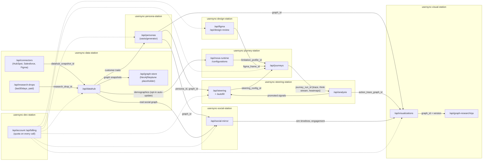

# UserSync — Product & Architecture Specification

**UserSync** is the product this repository is converging on: an AI usability-testing platform where
**Nova Act is the automation backend** — the driver of every usability-testing workflow — and the
frontend is a user-friendly workstation that prepares, steers, runs, and analyzes those workflows.

This spec supersedes `PROJECT_SPEC.md` (10-tab header navbar) and `UserSync/DELIVERY_SPEC.md`
(6-tab prototype). It defines the target tab UX, the workstation-pack architecture, the FastAPI
backend contracts, the rebranding plan, and the placeholder depth-specs for the concepts that still
need in-depth conceptualization (agent behavior steering, persona generation).

---

## 1. Vision

Nova Act stops being "one tab among many" and becomes the **execution engine underneath the whole
product**. Every user-facing feature triggers a Nova Act **workflow** — a prepared, parameterized,
reusable web-agent run — through a FastAPI layer. These are not generic LLM web agents: their
behavior is **steered** to simulate specific personas with specific browsing limitations, and the
agent's step-by-step thinking is captured **in the style of that persona** to produce usability
evidence.

Multidimensional adaptation of nova-act:

1. **Workflow-native usability testing** — `ui-test-execution-agent/` (Java/VNC test runner) is
   dissolved as a folder and fully re-created as Nova Act native workflows (`@workflow` decorator,
   `Workflow` class, `nova_act/cli/workflow/` deployer) that exercise UI user journeys across web
   content.
2. **Design/device dimension** — Nova Act runs are switchable between desktop, smartphone, and
   tablet views, and extended toward design surfaces (Figma boards/prototypes) so journeys can be
   tested against designs, prototypes, and live sites.
3. **Persona dimension** — OASIS-generated personas (from the upstream `generator/` module) shape
   how the agent browses (limitations) and how it reflects (thinking style).
4. **Data dimension** — DataHub connectors (HubSpot, Salesforce, other CRMs), `last30days` social
   research (paid), and web-monitoring integrations feed and validate persona generation.
5. **Social dimension** — an OASIS-driven living social network of the personas (Reddit/X style),
   compared against the real social graph built from real data.

---

## 2. Rebranding: UserSync

The rebrand starts at **Tab 1** and radiates outward during code adaptation.

- **Name**: the product is **UserSync** (not "Nova Act Suite"). Nova Act is named as the engine
  ("powered by Nova Act"), not as the brand. `Navbar.tsx` brand mark, `<title>`, README badges, and
  Space metadata change first.
- **Design language** (seeded from the current prototype, formalized as tokens):
  - Dark workstation surface (`#0a0a0a`/`#0b0b0b` panels, `gray-800` borders) with the teal accent
    retained as the UserSync primary; a secondary accent per pack is allowed but must come from one
    shared palette token file.
  - Every screen follows the same interaction grammar: **selected source → action button →
    progress state → generated artifact → evidence/provenance → approval/promotion →
    export/download**.
  - Cross-pack dependencies are shown as **linked source objects** (chips linking to the Journey
    Run, Persona, DataHub snapshot, or Research Drop that produced an artifact), never hidden.
- **Tab promise messaging**: each tab header carries a one-line service promise, adapted per tab
  (see the tab table below). These strings live in one `branding.ts` module so the rest of the
  design can be derived during coding without re-litigating copy.
- Remaining visual design is intentionally left to evolve during implementation, but only within
  the token file and interaction grammar above.

| Tab | Promise line (first draft, adapt during coding) |
| --- | --- |
| Journeys | "Run real user journeys with steerable AI testers." |
| Steering Lab | "Decide how your AI testers think, hesitate, and act." |
| Personas | "Grow user groups from your real customer data." |
| Nova Configurations | "Simulate the devices and limitations your users really have." |
| DataHub | "One graph of everything your users are made of." |
| Social Mirror | "Watch your personas live, post, and react — then compare to reality." |
| Dev & Account | "Your API. 1000 free credits. Metered, transparent, yours." |

---

## 3. Tab Specification (minimum 5 tabs; target 7)

The minimum shippable navigation is 5 tabs: **Journeys, Persona Generation, Nova Configurations,
DataHub, Social Mirror** — Persona Generation is a committed tab from the start (§ Tab 4). The
Steering Lab ships its UI early (parameter forms + LLM auto-fill) even while the steering
*mechanisms* stay a Depth-2 placeholder; Dev & Account completes the target 7.

### Tab 1 — UserSync Journeys (as-is, re-wired)

The existing UserSync tab stays, but every functionality is re-wired so that **each action triggers
a Nova Act workflow through FastAPI** instead of mock endpoints.

- Journey category selection, workflow generation, run controls, stage prompts, run traces,
  heatmaps, transcripts, downloads.
- Backend: **Journey & Nova Act Runtime API** (`/api/journeys`, `/api/nova-runtime`), a FastAPI
  service owning workflow definitions, run scheduling, and trajectory artifacts.
- A journey run is a Nova Act `Workflow` invocation: `workflow_definition_name`,
  `workflow_run_id`, per-`act()` steps with prompts, observations, AWL programs, and captured
  `think()` output (see §7) persisted as the run trace.
- The former `ui-test-execution-agent` capabilities (scripted UI test execution, run reports,
  screenshots/video evidence) are re-implemented here as prepared workflow templates. The Java
  folder is deleted once parity is demonstrated by workflow templates covering: journey replay,
  regression assertion (`act_get()` with schema), and evidence capture.

**Native Nova Act Console — UI parity with `nova.amazon.com/chat`.** The Nova Act views inside
this tab must **resemble exactly the current UI they are embedded in** at
`https://nova.amazon.com/chat`, so users who know Nova get zero-friction familiarity:

- Component inventory to mirror: session list/sidebar, central conversation thread with per-`act()`
  step cards, the prompt composer, and the live agent/browser preview panel — same placement, same
  interaction grammar, matching spacing/typography/dark-surface treatment. UserSync branding (§2)
  applies only to the surrounding shell (navbar, tab chrome), never inside the console surface.
- The live page is a JS-rendered app, so parity cannot be specced from static fetches. Fidelity is
  captured **with our own tooling**: a recurring UI-verification workflow screenshots
  `nova.amazon.com/chat` (authenticated session), extracts the component layout, and diffs our
  console views against it — the parity report is a standing artifact, and drift in the upstream
  UI opens a design task. Dogfooding: the product tests its own resemblance.
- Console views are thin: they render the same run traces, `think()` streams, and step cards the
  Journey runner produces — parity is a skin over shared components, not a fork.

### Tab 2 — Behavior Steering Lab *(UI committed; mechanism — Depth-2 spec, §4)*

How agent behavior can be steered. The steering **parameters get a real UI** (grouped forms per
steering surface, see §4), with one defining feature: an **LLM Auto-Fill** control. Auto-fill takes
the persona's demographics from generation plus specific user data (CRM record, monitoring
telemetry) and fills the steering configuration against nova agent capabilities automatically —
every auto-filled value shows its rationale and the persona field that drove it, and stays
user-overridable (§4.2). The underlying steering *mechanisms* remain open as a placeholder for
future development; §4 fixes the conceptual frame and the extension points without freezing the
solution.

### Tab 3 — Nova Configurations (browser limitations & device/design views)

Configuration studio for the **browser-level constraints** that restrict Nova agent behavior and
simulate real user conditions — e.g. an elderly person browsing the web — to surface usability
issues.

- **Device/view switching**: desktop / smartphone / tablet profiles built on what nova-act already
  exposes (`screen_width`, `screen_height`, `user_agent` in the `NovaAct` constructor), extended
  with Playwright/CDP device descriptors (touch, DPR, orientation).
- **Limitation profiles** (named, saveable, persona-linkable):
  - *Perceptual*: reduced viewport, font scaling, forced zoom, color-vision-deficiency emulation
    (CDP `Emulation.setEmulatedVisionDeficiency`), reduced-motion.
  - *Motor*: injected pointer jitter/misclick radius, slowed typing cadence, scroll granularity —
    implemented in the actuator layer (see §7 extension points).
  - *Cognitive/pacing*: `observation_delay_ms`, lowered `max_steps`, hesitation waits, re-reading
    (repeat observations before acting).
  - *Network/hardware*: CDP network throttling and CPU throttling profiles.
- **Figma/design integration** (see §6): a configuration can target a Figma prototype or frame set
  instead of a live URL.
- **Auto-update hook** (later): demographic data from DataHub (Tab 5) can auto-propose updates to
  limitation profiles; user opts in per profile ("shaped by data" badge with provenance link).
- Backend: part of the Journey/Runtime API surface (`/api/nova-runtime/configurations`), stored as
  versioned artifacts so runs record exactly which limitation profile they used.

### Tab 4 — Persona Generation (own tab, persona graph UI)

Persona Studio is a **dedicated tab** — not a DataHub subview — and deliberately goes **deeper
than the existing UserSync focus-group generation** (which today takes only `companyInfo`,
`customerProfile`, and a persona-scale slider). Its output is rendered as a **graph of personas in
the UI**, not a list.

**In-depth generation parameters** (contrast with the focus-group form):

| Parameter group | Controls |
| --- | --- |
| Business case | Case template, aim/task slots (maps to OASIS `user_info_template` slots), product context |
| Demographic distributions | Age range/histogram, gender mix, country mix — distributions, not single values |
| Psychographic distributions | MBTI mix, interests/topics, communication styles |
| Behavioral distributions | Activity level, engagement style (poster/lurker), exploration appetite |
| Network topology | Graph model for social ties (e.g. scale-free), density, community count — feeds the OASIS agent graph |
| Data bindings | DataHub snapshot refs, `last30days` research-drop refs, monitoring-telemetry refs that condition generation |
| Volume & reproducibility | Persona count, random seed, generation model |

**Persona graph UI**: generated personas appear as an interactive force graph (nodes = personas
with full profile drill-in; edges = generated social ties from the OASIS agent graph). This is the
same graph object DataHub time-captures (Tab 5) and Social Mirror (Tab 6) consume — one shared
`graph_id` artifact. Node inspector shows the persona's generator fields, its derived steering
signals (§4.3), and provenance chips for the data that shaped it.

Generation mechanics behind this tab are the Depth-3 spec (§5), entry point OASIS `generator/`.
The old focus-group builder in Tab 1 stays as the quick path and becomes a thin preset over this
tab's engine.

### Tab 5 — DataHub (persona network, connectors, pipelines)

The data workstation. Visualizations are first-class here.

- **Persona network graph**: personas generated by OASIS rendered as an interactive graph with
  detailed per-persona information (profile, habits, provenance). **Time captures** of the graph
  show how each persona is shaped over time by data updates, pipeline runs, and config changes.
- **Company data connectors** (paid service): HubSpot, Salesforce, and other CRM systems.
  Normalization layer maps CRM objects → UserSync canonical customer records → inputs to persona
  generation (feeding the OASIS `generator/` entry point). Pipelines are configured here; runs are
  logged with provenance.
- **`last30days` (paid extra service)**: brings in recent social data from various platforms,
  stored normalized and cleansed as **research drops**. (ML processing of these drops: later,
  explicitly out of scope for now.)
- **Monitoring integrations**: connectors to web/website monitoring services for real user-behavior
  telemetry, used to **validate** (and record *did validate*) the synthesized persona datasets.
- **Graph store**: placeholder for Amazon Neptune or Neo4j behind a `/api/graph-store` abstraction;
  ship first on file-based snapshots under HF `/data`, keep import/export in both directions.
- Backend: **DataHub & Integration API** (`/api/datahub`, `/api/connectors`, `/api/graph-store`).
- Demographic data from here later auto-updates the Nova limitation configurations (Tab 3) when the
  user opts in.

### Tab 6 — Social Mirror (OASIS living network, animated)

A living social network built from OASIS: the personas simulate **Reddit- and X-style** platforms,
growing a synthetic network whose analysis is **compared to the real social-analysis graph** built
from real data (which we also grow as a visual data graph; Neptune/Neo4j placeholder shared with
Tab 5).

- **Social network animation** is the tab's centerpiece: the generated personas' network plays as
  a time-stepped animation — nodes joining, ties forming (the generator's preferential-attachment
  edges), posts/comments/likes rippling through communities — with scrub/play controls over
  simulation timesteps. The animation renders the `to_graph_payload()` artifact produced by
  `oasis/generator/` (§5), so the persona graph in Tab 4, its DataHub time captures, and this
  animation are three views of the same `graph_id`.

- OASIS **network actions are conserved**: the OASIS action space (post, comment, like, repost,
  follow, search, …) remains the simulation vocabulary.
- **Nova×OASIS agent fusion** (exploration item): evaluate whether Nova Act actions can be
  translated to OASIS agent actions, or how to fuse an OASIS agent persona with a Nova agent so one
  agent has both benefits — *web navigation* (Nova) and *persona thinking in terms of website
  context, actions, and reflections* (OASIS). Candidate designs, to be prototyped in this order:
  1. **Prompt-fusion**: OASIS persona profile + memory injected into the Nova `act()` prompt;
     Nova `think()` output written back into OASIS agent memory (cheapest, no engine changes).
  2. **Action-bridge**: an adapter mapping OASIS `ManualAction`/platform actions onto Nova Act
     workflows against a real or mocked web UI of the simulated platform.
  3. **Shared-agent**: one agent loop where OASIS supplies the reflection/social policy and Nova
     supplies actuation — requires the §4 steering interfaces to exist first.
- Real-vs-synthetic comparison views: degree distributions, community structure, sentiment/topic
  drift, growth over time.
- Backend: **Social Mirror API** (`/api/social-mirror`, `/api/research-drops`).

### Tab 7 — Dev & Account (conserved Nova Act dev tab)

**Important to conserve.** The Nova Act developer tab for API access.

- We build **our own API endpoint** (the UserSync Gateway + per-pack APIs) and expose it here with
  docs, keys, and a console.
- **1000 free credits** budget per account, **measured**: every pack API call is metered against a
  `quota_category`; the usage ledger is visible here.
- **Company data integrations are a paid service** — entitlement checks gate the DataHub
  connectors.
- **Account backend: placeholder** for whichever service we adopt (Supabase is the current
  candidate for budgets; Stripe/payment abstraction behind an interface). HF login remains the
  identity anchor; paid UserSync API tokens are issued on top.
- Backend: **Developer, Identity & Billing API** (`/api/developer`, `/api/account`,
  `/api/billing`) — cross-cutting, consumed by every other pack.

---

## 4. Depth-2 Spec (placeholder): Steering Agent Behavior

> Status: **conceptual placeholder** — this section fixes vocabulary and extension points; the
> mechanism design is future work and must stay open.

**Goal**: steer Nova agents so they are not generic web agents but simulations of specific personas
— and capture the agent's thinking *in the persona's style* as usability evidence.

Two pillars:

1. **Exposing the LLM thinking tags.** Nova Act already emits explicit reasoning: each model step
   may contain a `think("...")` statement — a first-class no-op tool ("has no effect on the
   environment; should be used for reasoning about the next action") that the interpreter extracts
   and the dispatcher logs per step (§7). Steering means (a) surfacing this stream live in the UI,
   (b) persisting it per step in the run trace, and (c) **restyling/regenerating it through the
   persona lens** — a post-step transformation that rewrites the raw `think()` content as the
   persona would experience it ("I can't find the search box, the text is too small…"), stored
   alongside (never instead of) the raw reasoning.
2. **Simulating browsing limitations of a persona.** The persona's constraints bind to the
   limitation profiles of Tab 3 and to the runtime steering surfaces below.

### 4.1 Steering surfaces that exist in nova-act today

The extension points this tab will drive:

| Surface | Where | Steering use |
| --- | --- | --- |
| Prompt composition | `act(prompt)` | Persona framing, goals, vocabulary (no system-prompt param exists today — composition happens in our workflow layer) |
| Tool restriction | `tools: list[ActionType]` | Remove/replace actions a persona wouldn't use |
| Guardrails | `state_guardrail: GuardrailCallable` (URL → PASS/BLOCK) | Hard boundaries (no checkout, no external domains) |
| Agent redirect | `AgentRedirectError(error_and_correction)` | Mid-run corrective steering, injected back into the model loop |
| Pacing | `max_steps`, `timeout`, `observation_delay_ms` | Cognitive-load and hesitation simulation |
| Human-in-the-loop | `human_input_callbacks` | Supervisor pause on sensitive states |
| Actuator override | `ActuatorBase` | Motor-limitation injection (jitter, slow typing) |
| Events | `EventHandler` (LOG/ACTION) | Live streaming of steps/thinking to the frontend |

**Parameter taxonomy** (to be developed): direct / indirect / user-group / internal steering flags;
analysis configs; valuable-signal algorithms; promotion rules ("this steering setting produced
signal, promote it to the persona"); thinking-style summaries; acting-policy suggestions.

### 4.2 Steering UI with LLM Auto-Fill

The steering parameters get a real UI: one form section per steering surface (prompt composition,
tool restriction, guardrails, pacing, actuator, exploration). Its defining control is **Auto-Fill**:

```text
Persona profile (generator output: persona text, age, gender, mbti, country, activity)
  + specific user data (CRM record, monitoring telemetry, research drops)
  -> LLM Steering Auto-Fill service
  -> SteeringConfig JSON (schema-validated against nova agent capabilities)
  -> pre-filled UI form, every value overridable
```

- The auto-fill LLM receives the **capability schema** of the Nova agent (the steering-surface
  table in §4.1 rendered as a JSON schema) and must return a valid `SteeringConfig` — it can only
  fill knobs that actually exist; hallucinated parameters fail validation.
- Every auto-filled value carries `source_fields` (which persona/user-data fields drove it),
  a one-line `rationale`, and a `confidence`; the UI renders these as provenance chips.
- Auto-fill is per-section re-runnable ("re-derive pacing from persona") and never silently
  overwrites manual edits — manual values are locked until explicitly released.
- Accepted configs are versioned artifacts (`steering_config_id`) referenced by every journey run.

### 4.3 Extractable steering signals from OASIS persona generation

What can we mathematically or prompt-wise extract from OASIS persona generation and simulation
configuration? Grounded in the vendored docs (`oasis/docs/key_modules/*.mdx`,
`oasis/docs/user_generation/generation.mdx`):

**Mathematical / quantitative signals → numeric Nova steering knobs**

| OASIS source | What it encodes | Derived Nova steering |
| --- | --- | --- |
| Demographic scalars (`age`, `gender`, `country`) | Population facts per persona | Mapping curves to pacing: `observation_delay_ms = f(age)`, typing cadence, misclick radius, font-scale/zoom in the Tab-3 limitation profile |
| `available_actions: list[ActionType]` (per-agent allowed platform actions) | The persona's action repertoire | Direct analog to Nova `tools` restriction — intersect/weight the 6-action vocabulary per persona (e.g. a lurker persona rarely `agentType`s) |
| `EnvAction(activate_agents=[…])` per timestep | Who is active when — activity level as an activation schedule | Session frequency and step budget: journeys per persona per test cycle, `max_steps`, `timeout` scaling |
| Recsys parameters: `rec_prob` (personalized-vs-random balance, default 0.7), `refresh_rec_post_count`, `max_rec_post_len`, `following_post_count` | A quantitative **attention/exploration model** — how many items a persona scans, how much it follows familiar vs novel content | Exploration rate for UI paths: scroll depth per page, options considered before clicking (satisficing vs comparing), tendency to follow prominent/recommended elements vs idiosyncratic navigation |
| Agent-graph topology (degree, centrality, community of the generated network) | Social embeddedness | Influence weight: how strongly the persona's journey follows mainstream paths; comparison weights for Social Mirror real-vs-synthetic analysis |
| MBTI as a 4-axis vector | E/I, S/N, T/F, J/P | Axis-to-knob map: E/I → engage-vs-observe ratio; S/N → detail scanning vs global skimming (observation granularity, re-read counts); T/F → evaluation style in `act_get()` judgment prompts; J/P → plan-then-act vs opportunistic (backtrack probability, wait insertion) |
| `single_iteration: bool` | Reactive vs deliberative agent loop | Think-depth budget: one-shot decisions vs allowing chained reasoning before acting |

**Prompt-based signals → prompt composition & thought restyling**

| OASIS source | Mechanism | UserSync use |
| --- | --- | --- |
| Persona text fields (`persona`, `bio`, `user_char`, `description`) | Become the agent's system prompt in OASIS ("Your actions should be consistent with your self-description and personality") | Injected as the SELF-DESCRIPTION block of the composed `act()` prompt and as the style guide for persona-styled `think()` restyling |
| `user_info_template` (`TextPrompt` with profile slots, e.g. `{aim}`, `{task}`) | Templated system messages with schema-checked slots | Exactly our steering-prompt template mechanism: UserSync ships steering templates whose slots auto-fill from persona profile + business case |
| Demographic sentence pattern (Reddit template: "You are a {gender}, {age} years old, with an MBTI personality type of {mbti} from {country}") | Compact demographic grounding | Same sentence injected into Nova prompts and into the thought-restyling instruction |
| Interview mechanism (`interview_record`, twitter-interview cookbook) | Ask the agent reflective questions, record Q&A in memory | Post-journey **persona interviews**: after a run, interview the persona-styled agent about the experience ("what frustrated you?") — a new class of prompt-based usability evidence |
| Aim/task slots per business case | Goal phrasing per persona | Journey goal statements phrased in the persona's vocabulary and motivation |

The auto-fill service (§4.2) is precisely the codification of these two tables: the mathematical
rows become deterministic mapping functions (reviewable curves/tables, not LLM output), while the
prompt rows are where the LLM composes — auto-fill uses the LLM for language and templates, and
plain math for numbers, so numeric steering stays reproducible.

Backend: **Steering & Analysis API** (`/api/steering`, `/api/analysis`), including
`POST /api/steering/autofill` (persona ref + user-data refs → draft `SteeringConfig`). Everything
here is versioned and provenance-linked so a journey run records exactly which steering set
produced it.

---

## 5. Depth-3 Spec: Persona Generation via OASIS `generator/` — **first implementation landed**

> Status: **v1 implemented** in `oasis/generator/` (this repo). The OASIS generation pipeline was
> pulled (adapted from `camel-oasis` 0.2.5: `agents_generator.py` + `config/user.py`, Apache-2.0
> with modification notes) and adjusted to the steering goal. The deeper generation mechanics
> (LLM-driven trait synthesis from real DataHub records) remain open.

**The goal this generator serves**: create a **synthetic user group for the company** — based on
its product, its data, and the whole DataHub — to simulate user behaviour in online usability
tests, U-tests, content testing, and branding testing. Personas **express opinions**, and their
**physical, mental, and emotional features steer the Nova agent** representing them in its
**observing, thinking, and acting**.

What `oasis/generator/` implements (see its README for module detail):

- **Schema** (`schema.py`): the OASIS Reddit persona contract (incl. `profession`,
  `interested_topics`, validated key-compatible with `oasis/data/reddit/user_data_36.json`)
  extended with `PhysicalProfile` (vision acuity, color vision, motor precision, reaction time,
  fatigue, device), `MentalProfile` (digital literacy, attention span, working memory, exploration
  and planning style), `EmotionalProfile` (mood, patience, trust, risk aversion, brand affinity,
  expressiveness), `Opinion` (topic/stance/intensity/statement — the unit of content & branding
  feedback), and `CompanyContext` (company, product, business case, DataHub snapshot / research
  drop / monitoring refs).
- **Generation** (`generation.py`): seeded, distribution-driven `generate_personas()` conditioned
  on the company context; age conditions physical baselines; brand affinity anchors opinion
  stances; scale-free (preferential-attachment) social ties; optional **LLM hook** for persona
  text and opinion statements (the same hook the Steering Auto-Fill service uses). Outputs stay
  **upstream-compatible**: `to_oasis_reddit_json()` feeds `generate_reddit_agent_graph`
  unchanged; `to_graph_payload()` is the node/edge artifact the persona graph and the social
  network animation render.
- **Steering derivation** (`steering.py`): `derive_steering(persona)` produces a
  `NovaSteeringConfig` with three explicit blocks matching the triad —
  **physical → OBSERVING** (device viewport, zoom compensation, CDP color-vision deficiency,
  `observation_delay_ms`, re-read count), **mental → THINKING** (composed SELF-DESCRIPTION prompt
  block via the adapted OASIS `UserInfo` pattern, `think()`-restyle instruction, `max_steps`,
  options-considered/scroll-depth from exploration style), **emotional → ACTING** (allowed-action
  subset, hesitation waits, timeout, **frustration abort after N failed steps**, opinion
  expression). Every derived value is a `SteeredValue` with `source_fields` + `rationale` —
  the provenance-chip contract of §4.2. Numbers are deterministic math; the LLM is used only for
  language.
- **Demo**: `python -m oasis.generator 12 42 --out ./hub_demo` writes the OASIS profile file, the
  UI graph payload, and one steering config per persona.

### 5.1 Scaling budget: 2,000 personas in well under 30 minutes

Measured and designed-for numbers (benchmarks run in this repo):

| Phase | Mechanism | 2,000 personas | LLM calls |
| --- | --- | --- | --- |
| Deterministic skeleton | `generate_personas()` — profiles, opinions (deterministic text), ties, steering configs, graph payload | **~0.5 s** (10,000 in ~6 s) | **0** |
| LLM enrichment | `enrich_personas()` (`enrichment.py`): batched (default 10 personas/call), thread-pooled (default 16 concurrent), graceful per-batch fallback | **~5–10 min** at ~30 s/batch-call | **200** (`ceil(count / batch_size)`) |
| Naive per-item hook (`spec.llm`, serial) | kept for small groups (< ~50) | hours — do not use at scale | 4 × count = 8,000 |

Throughput sanity check: ~200–250 output tokens/persona ≈ 450k tokens total; at ~60 tok/s per
stream, even 8 concurrent streams finish in ~15 min — the binding constraint is provider rate
limits (200 batched calls ≈ 7 RPM: trivial), not compute. Cost at small-model pricing: low
single-digit dollars per 2,000-persona group.

**Progressive enrichment UX** (ties into §11): the skeleton renders in the persona graph
immediately; enriched paragraphs and opinion statements stream in per batch, nodes pulsing as
they update. A failed batch keeps deterministic text and is retried selectively
(`EnrichmentReport.failed_batches`).

**Simulation-side budget** (running the group in Social Mirror, distinct from generating it):
OASIS costs ~1 LLM call per *activated* agent per timestep. In a 30-minute window at concurrency
64 and ~5 s/call ≈ 23,000 calls — i.e. ~11 full timesteps with all 2,000 agents active, or 40+
timesteps activating a 25% subset per step (`EnvAction(activate_agents=…)`). Upstream ships a
1-million-agent instantiation path (`generate_agents_100w` with `active_threshold`), so agent
*count* is not the ceiling — per-step LLM calls are.

Still to shape (open): trait synthesis from real CRM/`last30days`/monitoring records (the
CRM-field → generator-field mapping table), approval/locking of persona updates, business-case
template library, and persona-scale controls. Backend: **Persona Hub API** (`/api/personas`,
`/api/lenses`) wraps this package.

---

## 6. Figma Integration Research

**How a Figma board is structured.** A Figma file is addressed by a `file_key`
(`figma.com/design/:file_key/:name?node-id=…`) and is a single **node tree**:
`DOCUMENT` → `CANVAS` nodes (the pages) → `FRAME` nodes (the artboards/screens a designer calls a
"board") → nested children (`GROUP`, `COMPONENT`, `INSTANCE`, `TEXT`, vector shapes). Every node
has an `id`, `name`, `absoluteBoundingBox`, fills/styles, and — crucially for us — text content and
layout geometry. FigJam boards are the same model with sticky/shape/connector node types.
Prototypes are frames plus interaction/flow metadata (`transitionNodeID`, flow starting points).

**Integration surfaces:**

| Surface | What it gives UserSync |
| --- | --- |
| REST `GET /v1/files/:key` and `/v1/files/:key/nodes?ids=…` | Full/partial node tree JSON — frame inventory, text, layout boxes for parity checks |
| REST `GET /v1/images/:key?ids=…&format=png&scale=…` | Rendered PNG/SVG exports of frames — the design-side baseline for visual comparison |
| REST `GET /v1/files/:key/comments` (+ POST) | Design comments in/out — comments become journey context; findings can be posted back |
| Webhooks v2 (`FILE_UPDATE`, `FILE_COMMENT`) | Re-trigger design-review workflows on design changes |
| Embed (`figma.com/embed?embed_host=usersync&url=…`) | Live file/prototype iframe inside the app |
| OAuth2 (or PAT for dev) | Per-user authorization; tokens live in the account layer |

**How Nova Act drives it:** an embedded Figma **prototype is itself web content** — the agent can
run a journey against the prototype exactly as against a live site (screenshot observation + click
coordinates; DOM selectors are not meaningful inside Figma's canvas, which is fine because Nova Act
is vision-driven). This enables three workflow families:

1. **Prototype walkthrough**: persona-steered journey through a Figma prototype before code exists.
2. **Design-to-live parity**: render frames via the images API, run the same journey on the live
   site, compare (layout drift, brand/component drift, missing states).
3. **Design import as journey context**: frame names/flows seed journey definitions; design
   comments attach as steering context.

Figma is implemented as a **DataHub connector** (`/api/figma` under the design-review pack) with
the same normalization/provenance rules as CRM connectors.

---

## 7. Analysis: the Current Thinking & Acting Dynamic in Nova Act

*(Requested report — this is how the engine behaves today, and what we build on.)*

**The loop** (`ActDispatcher.dispatch`, `src/nova_act/impl/dispatcher.py:216`):

1. **Prologue**: optional `wait(observation_delay_ms)` → `waitForPageToSettle` →
   `takeObservation` (screenshot as the model's world state).
2. **Think**: `backend.step(act, call_results, tool_map)` sends the prompt + observation to the
   Nova model, which returns a small **AWL program** (Agent Workflow Language — JS-like statements).
   The raw program is decoded and trace-logged every step.
3. **Interpret** (`src/nova_act/impl/interpreter.py`): the interpreter accepts at most **one
   `think("…")` statement immediately before the final statement**, plus **exactly one terminal
   action**: `agentClick`, `agentHover`, `agentType`, `agentScroll`, `goToUrl`, `wait`, `return`,
   or `throw`. `think` is a real registered tool whose contract is *"Has no effect on the
   environment. Should be used for reasoning about the next action."* — i.e., **the thinking tag is
   already a first-class, per-step, machine-readable artifact**, not something we need to scrape
   from logs.
4. **Act**: the program is compiled against the tool map (JSON-schema-validated arguments) and run
   by `ProgramRunner`; results feed the next step. `AgentRedirectError` lets the client reject an
   action and inject a correction string back into the loop.
5. **Terminate**: `return` completes the act (result string / `act_get()` schema extraction),
   `throw` raises `ActAgentFailed`; `max_steps` and `timeout` bound the loop; pause/cancel run
   through `NovaStateController`; each step is appended to the `Act` object and persisted to
   trajectory files (`run_info_compiler.py`, session logs directory).

**Important clarification**: the `Thinker` class (`impl/thinker.py`) is *only a console spinner*
(animated dots while waiting on the model) — it is UX, not reasoning. The actual reasoning stream
is the `think()` calls inside AWL programs.

**Consequences for UserSync:**

- Exposing thinking (Depth-2 pillar 1) is an **extraction problem, not an engine change**: capture
  `think()` calls per step via the existing `EventHandler`/trace pipeline and stream them to the
  frontend; persona-styled restyling is a post-processing layer.
- The action vocabulary is small and closed (6 actions + return/throw) — translating it to OASIS
  social actions (§ Tab 6 fusion) is a tractable mapping exercise.
- Persona steering has no native slot (no system prompt, no persona param) — it must live in our
  workflow layer: prompt composition, tool restriction, guardrails, pacing, and actuator overrides
  (table in §4).
- One `think` + one action per step means persona pacing/hesitation is naturally simulated by
  inserting `wait` steps and observation delays rather than fighting the loop.
- The `workflow` module (`types/workflow.py`, `cli/workflow/`) already gives us named, deployable,
  run-tracked workflow definitions — the landing zone for the `ui-test-execution-agent`
  transformation and the unit the Journeys tab schedules.

---

## 8. Workstation Packs (app consistency model)

Features group into **workstation packs**: coherent frontend areas that run together in the full
product but can be split into independently deployable stations backed by narrow FastAPI services.
A pack is a pattern of UI surfaces + APIs + data artifacts + permissions that users experience as
one job-to-be-done.

| Pack | Tabs (this spec) | API stack | Split-out station |
| --- | --- | --- | --- |
| 1. Journey Execution | Tab 1 (+ Tab 7 dev mode) | Journey & Nova Act Runtime API | `usersync-journey-station` |
| 2. Steering & Analysis | Tab 2 | Steering & Analysis API | `usersync-steering-station` |
| 3. Visualization & Research | graph views in Tabs 5/6 | Visualization API | `usersync-visual-station` |
| 4. Persona & Experience | Tab 4 (+ lenses in Tab 3) | Persona Hub + Experience Lens API | `usersync-persona-station` |
| 5. DataHub Integration | Tab 5 | DataHub & Integration API | `usersync-data-station` |
| 6. Social Enrichment | Tab 6 | Social Mirror API | `usersync-social-station` |
| 7. Design & Brand Review | Figma surfaces of Tabs 1/3/5 | Journey + Visualization + DataHub APIs | `usersync-design-station` |
| 8. Developer, Identity & Billing | Tab 7 | Developer/Identity/Billing API | `usersync-dev-station` |

Consistency rules:

- Every pack exposes its own narrow FastAPI router and MCP tool group; all packs share identity,
  entitlement, audit, provenance, and artifact-storage conventions.
- Same design language everywhere (§2 interaction grammar).
- Cross-pack dependencies appear as linked source objects in the UI.
- Stations stay composable: each can run alone for a narrow buyer; the full app stitches them
  through shared IDs, HF `/data` artifacts, graph references, and API contracts.
- No oversized endpoints: cross-pack orchestration passes **artifact IDs and provenance
  references, not giant payloads** (`journey_run_id`, `persona_id`, `datahub_snapshot_id`,
  `research_drop_id`, `graph_id`, `figma_frame_id`).

Feature consistency pattern:

```text
Frontend pack
  -> Narrow FastAPI router
  -> Shared auth/entitlement check
  -> Pack-specific artifact
  -> HF /data + optional graph-store reference
  -> Visualization / report / downstream steering promotion
```

---

## 9. Hugging Face Space Deployment Model

Each pack is buildable as its own HF Space, testable and sellable alone, and combinable into the
full app through a thin **UserSync Gateway API** (cross-pack routing, account lookup, quota
enforcement, audit logging, artifact-reference passing).

```text
Full UserSync frontend
  -> UserSync Gateway API
    -> usersync-journey-station    /api/journeys, /api/nova-runtime
    -> usersync-steering-station   /api/steering, /api/analysis
    -> usersync-visual-station     /api/visualizations, /api/graph-research
    -> usersync-persona-station    /api/personas, /api/lenses
    -> usersync-data-station       /api/datahub, /api/connectors, /api/graph-store
    -> usersync-social-station     /api/social-mirror, /api/research-drops
    -> usersync-design-station     /api/design-review, /api/figma
    -> usersync-dev-station        /api/developer, /api/account, /api/billing
```

Per-Space runtime requirements:

- FastAPI app mounted under the pack base paths; small standalone frontend shell.
- HF OAuth login reading identity from the shared account layer.
- `/healthz`; `/openapi.json` with stable operation IDs; `/mcp` manifest when the pack exposes
  agent-callable tools (gateway generates MCP namespaces `usersync.journey.*`, `usersync.visual.*`,
  `usersync.persona.*`, `usersync.social.*`, …).
- Shared headers: `Authorization`, `X-UserSync-Account-Id`, `X-UserSync-Workspace-Id`,
  `X-UserSync-Run-Id`, `X-UserSync-Artifact-Root`.
- Shared response envelope: `artifact_id`, `provenance`, `quota`, `warnings`, `next_actions`.
- Storage under `/data/users/{hf_user_id}/…` with pack subfolders
  (`journeys/ steering/ analyses/ visualizations/ graph_research/ personas/ lenses/ connectors/
  graph_snapshots/ social_mirror/ research_drops/ design_reviews/ account/ usage/`).
- Optional Neo4j/Neptune connection through HF Secrets where graph runtime is needed.

Combination rules: expose capabilities not internals; pass artifact references not payloads;
gateway is source of truth for auth/quotas/budgets; provenance is portable (source Space, endpoint,
input artifact IDs, user/account IDs, timestamp, version); each Space independently useful; MCP
tools generated from pack OpenAPI.

Gateway service-registry entry (shape):

```json
{
  "usersync-visual-station": {
    "space_url": "https://huggingface.co/spaces/usersync/usersync-visual-station",
    "api_base_path": "/api/visualizations",
    "openapi_url": "/openapi.json",
    "mcp_manifest_url": "/mcp",
    "quota_category": "visualization_api_calls",
    "artifact_root": "/data/users/{hf_user_id}/visualizations"
  }
}
```

---

## 10. Current State (what exists today, honestly)

| Asset | State | Fate under this spec |
| --- | --- | --- |
| `UserSync/` frontend (6 tabs + subview slider) | Working Vite/React prototype | Rebranded Tab-1 seed; re-wired to FastAPI/nova-act workflows |
| `UserSync/server.cjs` (Express) | Only running backend; real HF OAuth; mock nova/mindwalk/omniparser endpoints | Replaced by per-pack FastAPI services + gateway |
| `UserSync/fastapi_app.py` | Inert reference, not deployed | Seed of the first FastAPI station |
| `src/nova_act/` | Full Nova Act SDK incl. `workflow` module | **The engine.** Untouched core; extended via §4 steering surfaces |
| `ui-test-execution-agent/` (Java) | Standalone, unintegrated | **Dissolved** → Nova Act native workflow templates (Tab 1) |
| `oasis/` | Docs/data/assets + **`oasis/generator/` (new)**: adapted OASIS generation with physical/mental/emotional steering, opinions, and `derive_steering()` | Persona Hub API wraps `oasis/generator/`; upstream `camel-oasis` added when the simulation runtime lands |
| `last30days-skill/` | Full standalone CLI/skill | Wrapped as paid research-drop service in DataHub |
| `nova-act-agent-skills/` | Skill/packaging metadata | Source for MCP tool wrapping conventions |
| HF login | Real OAuth in Express; cookie-only, no user records | Anchor identity for account layer; move to shared account resolution + tokens/credits |

## 11. Frontend Overhaul: Dynamic Site Progression & Motion

Audit of the current UserSync frontend (how to overwork it for better dynamics):

- Tailwind is loaded from the **CDN** (`cdn.tailwindcss.com` in `index.html`) with a second,
  conflicting dependency path via an ESM importmap — no build-time config, so custom
  keyframes/plugins can't be registered.
- Several used animation classes (`animate-in`, `fade-in`, `animate-fade-in-up`) come from the
  `tailwindcss-animate` plugin which is **not installed → they are silently dead** today.
- Motion is limited to hover `transition-*` and spinners (`animate-spin`/`animate-pulse`). There
  are **no transitions between tabs or subviews** — `MainTabViews` swaps content abruptly via
  conditional render; `SubViewSlider` has no sliding motion, no animated active indicator, and the
  active card is not scrolled into view.
- Navigation is pure component state — no URL sync, so browser back/forward and deep links don't
  work, which blocks any route-driven transition model.

Target motion spec:

1. **Foundation first**: move Tailwind to a build-time dependency with a `tailwind.config` that
   registers the motion tokens; remove the CDN script and importmap duplication; add one motion
   library (Framer Motion) or adopt the native View Transitions API — pick one, use it everywhere.
2. **Directional workspace transitions**: tab and subview changes animate as a crossfade + slide
   whose direction follows the slider index delta (moving to a higher-index subview slides left,
   lower slides right); `AnimatePresence` handles unmount. Duration/easing come from two shared
   tokens (`motion.fast` ≈150ms, `motion.view` ≈300ms) so the whole app feels like one system.
3. **SubViewSlider upgrade**: animated active-indicator (layout-animated highlight sliding between
   cards), auto `scrollIntoView` of the active card, drag/swipe to change views, and subtle
   progress dots — making the `< >` slider feel like a physical carousel.
4. **Progressive content loading**: skeleton loaders for every API-backed panel; staggered entrance
   for card grids (stagger-children, 30–50ms steps); scroll-linked reveals for landing sections.
   Content appears as it becomes ready instead of popping in one frame.
5. **Live-run motion** (the product moments): streaming step/`think()` timeline with typewriter
   rendering (the existing `animate-blink` cursor keyframe finally gets used), animated journey
   progress, and graph dynamics — force-layout transitions when the persona graph changes, node
   pulse on data updates, animated time-capture scrubbing in DataHub.
6. **URL-synced navigation**: tabs/subviews reflected in the route (`/journeys/steering-set`),
   enabling deep links, browser back/forward with matching directional transitions, and
   per-tab-promise page titles (ties into §2 branding).
7. **Reduced motion**: every animation respects `prefers-reduced-motion` — non-negotiable for a
   product whose pitch is accessibility-aware usability testing.

## 12. Graph View System — the Mindwalk adaptation family

From `cosmtrek/mindwalk` we take **only the graph visualization** (the in-app adapter approach the
prototype already uses — no vendored code, an inspired reimplementation). It becomes **one base
graph component with per-use-case adaptations**: every graph surface in the app is a configured
variant of the same view, so interaction grammar (select node → inspect → provenance → promote),
theming, and the Q&A panel are learned once.

### 12.1 The variant registry

| Variant | Tab | Nodes | Edges | Proximity semantics | Adaptation specifics |
| --- | --- | --- | --- | --- | --- |
| **Action Trace Graph** | Journeys / Steering analysis | Agent actions per step (action type, target, screenshot, heatmap footprint, raw + restyled `think()`) | Sequential run path; cross-run similarity links | **Similarity layout** (see 12.2) | Run-vs-run and persona-vs-persona overlay; channel blend slider (heatmap vs thinking) |
| Persona Graph | Persona Generation | Personas (full profile + steering summary) | Generated social ties | Community/affinity clustering | Node inspector with §5 profile blocks and steering chips |
| DataHub Provenance & Time Captures | DataHub | Artifacts, pipeline runs, connector sources, personas | Provenance references | Pipeline lineage distance | Time-capture scrubbing (§ Tab 5); diff highlighting between captures |
| Social Mirror Animation | Social Mirror | Personas as platform users, posts/comments | Follows, interactions | Network topology (force) | Time-stepped playback (§ Tab 6); real-vs-synthetic side-by-side |
| Navigation Memory | cross-tab (dev/debug) | Tabs, subviews, personas, limitations | navigates-to / constrains / calls-api | UI adjacency | The existing prototype adapter (`MindwalkGraphView`), kept as the base-component reference |
| **Endpoint Connection Map** | Dev & Account | Pack API endpoints | Artifact flows (§13) | Pack grouping | Rendered live from gateway registry + OpenAPI; edge tooltips show artifact schemas and live call counts |

### 12.2 Action Trace Graph — proximity analysis (use case 1)

The primary analysis view for UI testing: show the actions an agent took and **how they connect**,
with **proximity encoding similarity** so divergence is visible at a glance and analyzable later.

Two similarity channels, each a deterministic metric stored with the analysis artifact:

- **Heatmap similarity**: each action/run carries an interaction-heatmap footprint (click/scroll
  coordinates, dwell areas on the page grid); similarity = spatial overlap of the rasterized
  heatmaps (e.g. IoU or earth-mover distance on the grid). *"How similar were they on heatmaps?"*
- **Thinking similarity**: embedding distance (cosine) between `think()` texts of the compared
  steps/runs — computed on the **raw** reasoning, with the persona-restyled variant inspectable
  alongside. *"How similar or different was what they were thinking?"*

The layout blends the channels (user-controlled slider); nodes that acted alike but thought
differently (or vice versa) visibly separate — that tension is exactly the usability signal the
Steering & Analysis pack promotes (§4). All pairwise scores persist as
`action_trace_analysis_id` artifacts for later analysis.

### 12.3 AI Graph Answers — LLM Q&A per graph, regenerated on update

Every graph variant carries a Q&A panel: **questions and answers are both LLM-generated** from
the graph context (serialized nodes/edges/metrics + the variant's semantics), and **dynamically
regenerated when the graph updates**.

```text
POST /api/graph-research/qa
{ "graph_id", "graph_version", "variant", "focus_node_ids"?, "previous_qa"? }
-> { "qa": [ { "question", "answer", "grounded_node_ids", "stale": false } ],
     "regenerated": ["qa-3"], "kept": ["qa-1","qa-2"] }
```

- Regeneration is **debounced and diff-aware**: on a graph update, answers grounded in changed
  nodes are marked stale and regenerated; untouched Q&A stays stable so the panel doesn't churn.
- Answers must cite `grounded_node_ids`; clicking an answer highlights its evidence in the graph
  (the §2 evidence/provenance grammar).
- Users can pin questions (always re-answered on update) and ask free-form ones (added to the set).

## 13. API Endpoint Connection Map

All tabs are connected to each other — through **artifact references flowing between pack APIs**,
never through shared frontend state. This is the connection graph (also rendered live as the
Endpoint Connection Map variant in the Dev tab):



Reading the map: DataHub feeds persona generation; personas feed steering (auto-fill) and the
social simulation; steering + limitation profiles + design frames feed journey runs; runs feed
analysis; analysis feeds graphs and promotes signals back into steering — a closed loop, with
account/billing metering every edge.

## 14. Standalone API Products — where the endpoints differentiate

Each cluster below can ship as its **own station/Space with its own buyer** (§9), valuable without
the rest of the app. Qualification rule: one artifact in, one artifact out, meterable
`quota_category`, useful in isolation.

| Standalone product | API base | In → Out | Buyer & standalone value |
| --- | --- | --- | --- |
| **Persona Synthesis API** | `/api/personas` | Product description (+ optional CRM/CSV) → synthetic user group with physical/mental/emotional profiles + opinions | Market research, CRO agencies, teams without user panels. Differentiator: personas are **machine-actionable** (steering-ready), not demographic slide-cards |
| **Agent Steering API** | `/api/steering` | Persona/user JSON → validated agent steering config | Anyone building agents (Nova today, adaptable). Differentiator: per-value provenance + deterministic numeric core (§4.2) |
| **Usability Journey API** | `/api/journeys` | URL + goal + persona → run trace, findings, persona-voiced feedback | QA teams and agencies. The core product. Differentiator: persona-steered runs vs. generic bot checks |
| **Graph Answers API** | `/api/graph-research/qa` | Any graph JSON + version → grounded Q&A, diff-aware refresh | BI/observability vendors embedding graph explanation. Differentiator: stable Q&A sets that only regenerate what changed |
| **Design Parity API** | `/api/design-review` | Figma frame + live URL → drift/parity report | Design-system teams. Differentiator: vision-driven agent walks the live page, not DOM-only diffing |
| **Content Pre-Test API** | `/api/social-mirror` | Content + persona group → simulated engagement + opinion breakdown | Marketing teams pre-testing copy/campaigns. Differentiator: opinions traceable to persona features and data provenance |
| **Research Drops API** | `/api/research-drops` | Topic/brand → normalized, cleansed recent social data | Social-listening consumers; a paid data feed (last30days) |

Deliberately **not** standalone: `/api/nova-runtime` (an implementation detail of journeys),
`/api/datahub` connectors (paid add-on bound to an account, not a product), and
`/api/account`/`/api/billing` (cross-cutting). The gateway's service registry (§9) is the single
place a cluster gets flipped from internal to sellable.

## 15. Plan Aspect 1 — Data Unification: from data sources to steering parameters

*(Implemented v1 in `backend/app/routers/datahub.py` → `POST /api/datahub/unify`.)*

Persona generation runs in one of **three source modes**, selected per generation:

1. **`synthetic`** — all-synthetic: distribution defaults only; the pool mimics no one in
   particular. Zero data prerequisites, instant start.
2. **`company`** — company data enabled: HubSpot / Salesforce / other CRM records (imported via
   `POST /api/connectors/{name}/import`, a **paid service**) are normalized into a canonical
   `CrmRecord` shape and shape the pool so it **mimics the real customer base**.
3. **`company_social`** — additionally, `last30days` researches the current customers' comments,
   thinking patterns, and behaviour online — scoped by what the company considers its customer
   profile — normalized into a `ResearchDropSummary`.

**The unification pipeline** (each stage an artifact with provenance):

```text
CRM records ─┐
research drop ├─> POST /api/datahub/unify ─> UnifiedTraits (unified_traits_id)
monitoring ──┘         │
                       └─> passed to POST /api/personas/generate
                             └─> GenerationSpec distributions -> personas
                                   └─> derive_steering() -> Nova steering params
```

**Translation table — how each data source becomes steering** (v1 mappings, all deterministic
and reviewable):

| Source signal | UnifiedTraits field | Generation effect | Final steering effect |
| --- | --- | --- | --- |
| CRM ages | `age_range` | Age distribution of pool | Age-conditioned physical baselines → observation delay, zoom, motor precision |
| CRM gender/country/job title | `genders`, `countries`, `professions` | Demographic distributions | Prompt SELF-DESCRIPTION grounding |
| CRM engagement score | `digital_literacy_mean` | Literacy distribution shifts | `max_steps`, tech-confidence, exploration budgets |
| CRM support-ticket volume | `patience_mean` (inverse) | Emotional patience distribution | Frustration abort threshold, hesitation, timeout |
| CRM NPS | `brand_affinity` (peaked distribution) | Opinion stance anchoring | Opinion expression in content/branding tests |
| last30days sentiment | `brand_affinity` (overrides NPS when fresher) | Same, from live social voice | Same, plus think-restyle tone |
| last30days top/complaint topics | `opinion_topics`, `complaint_topics` | Opinion topics replace business-case defaults | What personas voice opinions about |
| last30days activity level | `activity_level` | Activation schedules in Social Mirror | Journeys per persona per cycle |
| Monitoring avg session length | `patience_mean` (validated) | Calibrates patience against *observed* behaviour | The validation loop: synthesized pool vs. real telemetry |

Rules: **fresher beats staler** (research drop overrides CRM-derived affinity), **observed beats
inferred** (monitoring telemetry recalibrates any mean), and every UnifiedTraits artifact records
which sources contributed (`provenance.mode`, record counts) so a persona pool can always answer
"who am I mimicking, based on what?".

Open for later: per-field confidence weighting, incremental re-unification on connector sync,
and the CRM-field mapping UI in DataHub.

## 16. Plan Aspect 2 — From Testing Runs to Meaningful Decisions

*(Implemented v1 in `backend/app/routers/analysis.py` and `uxchain.py`.)*

### 16.1 The analysis pipeline

```text
journey runs (steered Nova agents, per persona)
  -> POST /api/analysis/action-trace       # Action Trace Graph (§12.2)
       heatmap similarity  (soft-IoU on rasterized interaction grids)
       thinking similarity (raw think() text; embedding-pluggable metric)
  -> POST /api/analysis/decisions          # decision candidates
  -> POST /api/graph-research/qa           # grounded Q&A over the graph (§12.3)
```

The decision logic reads the **two similarity channels against each other** — that tension is
the product's core insight:

| Pattern | Meaning | Decision candidate |
| --- | --- | --- |
| Acted alike, thought differently | Personas share the path but one group absorbs friction silently | Targeted copy/affordance fix on the shared path |
| Thought alike, acted differently | Same intent, competing routes | Consolidate navigation; promote the shorter route |
| Full divergence | Segment-specific experience | Persona-conditional variant or onboarding |

### 16.2 Output APIs for downstream agents

Testing results are **agent-consumable products**, not just reports:

- **Design-agent MCP**: every operation is exposed as an MCP tool via `GET /mcp`
  (auto-generated from the pack OpenAPI: `usersync.analysis.analysis_decisions`,
  `usersync.uxchain.uxchain_run`, …23 tools live). A design UI agent (Figma plugin agent, code
  assistant) calls these to ground its design choices in persona testing: *"which personas
  struggled on this screen, why, and what fix is proposed?"*
- **Decision sets** (`decision_set` artifacts) carry machine-actionable fields
  (`kind`, `runs`, `signal`, `decision_candidate`) plus provenance to the exact graph and runs.
- **Persona-voiced evidence**: the restyled `think()` streams and opinions attach to findings, so
  a design agent can quote *the user's experience in their own words*.

### 16.3 The 3-piece UX chain (website, app, and content testing)

`POST /api/ux-chain/runs` produces the three-piece evidence chain, rendered as three cards:

```text
[1] screenshot + heatmap  ->  [2] UX/UI problem identified  ->  [3] solution
```

- **Piece 1**: the tested screen with its interaction heatmap — from a Nova journey run
  (`journey_run_id`) or generated by **ux-mentor** (`/generate_heatmap/` at
  `https://leon4gr45-ux-mentor.hf.space` — UX Analysis mode: heatmaps, drop-offs, UX score).
- **Piece 2**: the identified problem with evidence and severity (heatmap density + persona runs).
- **Piece 3**: the fix — **screenshot-to-code** (github.com/abi/screenshot-to-code) regenerates
  the screen as code, the code is optimized against the problem, and the result is **re-rendered
  to a screenshot that solves the issue** (ux-mentor `/generate_iteration/` — Design Iteration
  mode). *Integration status: the fork `JsonLord/screenshot-to-code` is vendored into the session
  and its real protocol is implemented in `backend/app/adapters/screenshot_to_code.py` — the
  WebSocket `/generate-code` contract (`generatedCodeConfig` stack, `inputMode`, streamed
  `setCode`/`variantComplete` messages) with a **two-pass flow**: pass 1 recreates the screen from
  the screenshot (`generationType: create`), pass 2 optimizes that code against the identified
  problem (`generationType: update` with history). Its `POST /api/screenshot` also captures live
  target URLs for piece 1 (`SCREENSHOTONE_API_KEY`). Deploy the fork as a Space and set
  `SCREENSHOT_TO_CODE_BASE_URL`; `UX_MENTOR_BASE_URL` points at the existing ux-mentor Space.
  Unconfigured engines degrade to structured pieces flagged `simulated: true`, keeping the
  contract testable (verified by an adapter test against a fake protocol server).*

**Card UX** (implemented in `UserSync/components/UxMentorChain.tsx`, wired as the Nova Act tab's
"UX Chain" subview): each card has a **switch control** flipping between the **rendered design**
and its **code** representation (pieces that have both — the solution always does); a **dropdown
menu** switches between the three ux-mentor modes (**UX Analysis**, **User Journey**, **Design
Iteration**), re-running the chain per mode. The chain also runs per **Experience Lens** (device/
limitation profile), so the same screen yields per-persona chains — content testing feeds the
same chain with content variants instead of URLs.

## 17. Implementation Order

1. Rebrand Tab 1 to UserSync (brand mark, titles, `branding.ts` promise lines, token file) and lay
   the motion foundation (§11 items 1–2: build-time Tailwind, motion library, view transitions).
2. ✅ FastAPI backend landed in `backend/` (eight pack routers, standalone via `USERSYNC_PACKS`,
   `/healthz`, `/openapi.json`, `/mcp` manifest, HF OAuth, credits ledger, artifact store,
   Dockerfile for Space deployment, 7 smoke tests). Next: execute journeys through a live
   `nova_act` workflow when `NOVA_ACT_API_KEY` is configured.
3. Port one `ui-test-execution-agent` scenario as a Nova Act workflow template; delete-parity list.
4. Nova Configurations tab: device profiles + first limitation profiles on existing constructor
   params; CDP throttling next.
5. Expose the `think()` stream per step in the run trace UI (Depth-2 pillar 1, extraction only)
   with the live-run motion treatment (§11 item 5), rendered in the Nova-chat-parity console
   shell (§ Tab 1); stand up the recurring parity-screenshot workflow against
   `nova.amazon.com/chat`.
5b. Build the base graph component (§12) by generalizing the existing `MindwalkGraphView`; ship
   the Action Trace Graph variant (heatmap + thinking similarity channels) and the
   `POST /api/graph-research/qa` endpoint with diff-aware regeneration.
6. Persona Generation tab v1: in-depth parameter form + persona graph UI over the landed
   `oasis/generator/` package (✅ generation, steering derivation, and graph payload exist —
   `python -m oasis.generator`); wrap it in the Persona Hub API.
7. Steering Lab UI + Auto-Fill: surface `derive_steering()` output (✅ provenance-chip
   `SteeredValue`s implemented) in the parameter forms; add the LLM hook for prompt rows;
   `POST /api/steering/autofill`.
8. DataHub skeleton: HF `/data` artifact conventions, shared persona `graph_id` with time
   captures, first connector stub (Figma or HubSpot).
9. Social Mirror: OASIS Reddit/X simulation on generated personas; comparison views; prompt-fusion
   prototype (§ Tab 6, design 1).
10. Gateway + service registry; account layer with 1000-credit metering (Supabase placeholder).
11. Deepen the Steering Lab as §4 mechanisms harden through use.
